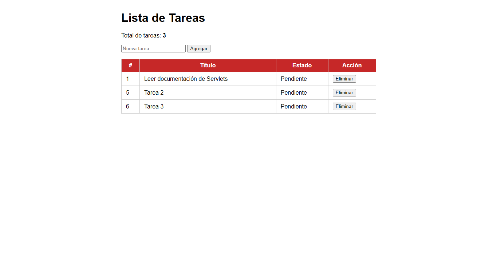
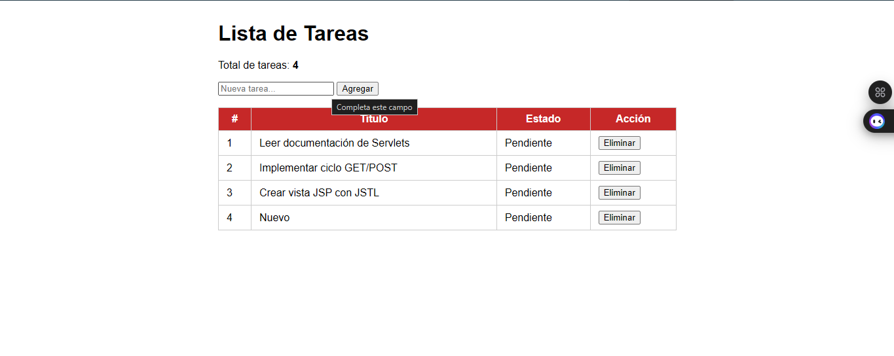
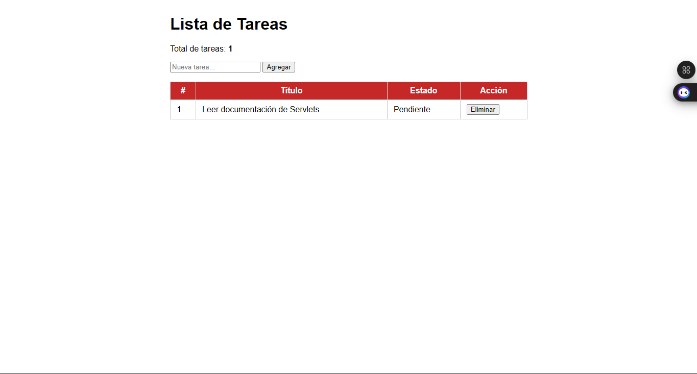

# Gestión de Tareas - Servlet y JSP

**Autor:** Farid Lobo 
**Materia:** Programación Web  
**Universidad:** UFPS

## Descripción
Aplicación web Java que gestiona una lista de tareas en memoria usando Servlets y JSP, aplicando el patrón Post/Redirect/Get (PRG).

## Tecnologías
- Java 17+
- Jakarta Servlet API 6.0
- JSP + JSTL 3.0
- Apache Tomcat 10.1
- Maven

## Estructura del proyecto

src/
main/
java/
com.ejemplo.model/     → Clase Tarea
com.ejemplo.servlet/   → TareasServlet
webapp/
WEB-INF/
views/tareas.jsp     → Vista principal
web.xml
index.jsp

## Instrucciones de ejecución
1. Clonar el repositorio
2. Abrir en IntelliJ IDEA con el plugin Smart Tomcat
3. Ejecutar con Tomcat 10.1 en el puerto 8081
4. Acceder a: http://localhost:8081/gestion-tareas

## Funcionalidades.
- ✅ Listar tareas (GET)
-  
- ✅ Agregar tarea con validación (POST)
- 
- ✅ Eliminar tarea (POST)
- 
- ✅ Patrón PRG implementado